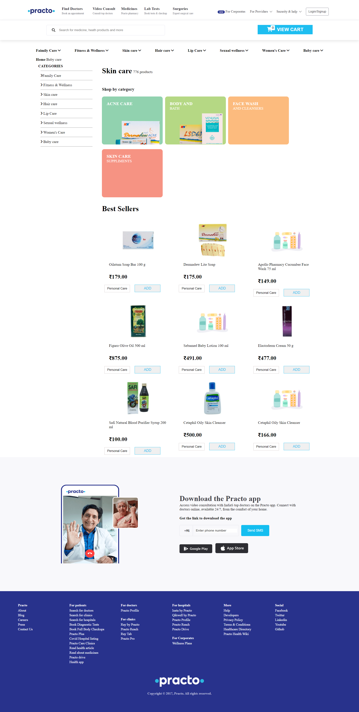

# Practo_Clone
In this project we had to practo website clone. This whole project is made by using HTML, CSS, Java-Script and to store data we have used Local Storage
>Live Check : •[Click Here](https://pract-pro-clone.netlify.app/html/home)
## Team Members
> ## Github :- •[Arvind Maurya](https://github.com/MB7232SP)
>
> ## Github :-•[Anubhav Singh](https://github.com/anubhav1327)
>
> ## Github :-•[Gautam Kumar](https://github.com/gautamkumar1912)
>
> ## Github :-•[Manjusha Raut](https://github.com/Manjusha003)
## Built with

<ul>
  <li>HTML</li>
  <li>CSS</li>
  <li>JavaScript</li>
  <li>Local Storage</li>
  <li>Netlify</li>
  
</ul>

## Features

<ul>
  <li>Signin/Signup</li>
  <li>Buy medicine and skin products</li>
  <li>Payment gateway</li>
</ul>

## Some screenshots of the project :-

## Home Page

  

## Sign In page

 
## Register page
   

## Product page

### Thanks for Reading.

